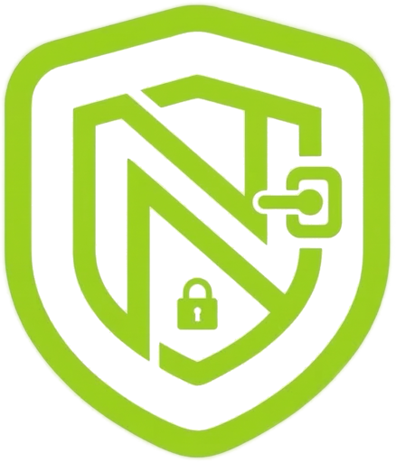

<p align="center">
  
</p>

<h1 align="center">NKVault</h1>
<p align="center">
  <strong>NO-Knowledge Vault — Zero-knowledge password manager</strong>
</p>
<p align="center">
  <a href="#features">Features</a> •
  <a href="#how-it-works">How It Works</a> •
  <a href="#security">Security</a> •
  <a href="#getting-started">Getting Started</a> •
  <a href="#browser-extension">Browser Extension</a> •
  <a href="#contributing">Contributing</a>
</p>
<p align="center">
  
  
  
  
</p>

---

## What is NKVault?

NKVault is a **zero-knowledge password manager** where your data is encrypted client-side before it ever touches a server. No one — not even the server — can read your passwords.

Your vault key is derived from your **Solana wallet signature**, meaning only your physical wallet can unlock your data. No master password to remember, no server-side secrets to leak.

## Features

### 🔐 Zero-Knowledge Architecture
- All encryption/decryption happens **in your browser** using the Web Crypto API
- AES-256-GCM encryption with unique IVs per operation
- Vault key never leaves the client, never stored on any server

### 🪙 Wallet-Based Authentication
- Sign in with your Solana wallet (Phantom, Solflare, etc.)
- Deterministic key derivation from wallet signature
- No master password required — your wallet IS your key

### 📦 Store Everything
- **Logins** — username, password, URL with favicon
- **Credit Cards** — card number, expiry, CVV
- **Secure Notes** — free-form encrypted text
- **Identities** — name, email, phone, address

### 🌐 Browser Extension (Chrome & Opera)
- **Autofill** — detects login forms and fills credentials
- **Auto-fill signup forms** — fills identity data + generates strong passwords
- **Autosave** — prompts to save new logins or update changed passwords
- **Password generator** — create strong passwords instantly
- **URL matching** — suggests relevant credentials per site

### 🔄 Real-Time Sync
- Powered by [InstantDB](https://instantdb.com) — changes sync across devices instantly
- Shared vaults for team credential sharing
- Works offline, syncs when reconnected

### 🎨 Premium UI
- Dark-mode-first design with lime green accents (`#B8FF00`)
- Space Grotesk typography
- Smooth animations and micro-interactions
- Responsive layout (desktop + tablet)

## How It Works

```
┌──────────────┐     ┌──────────────┐     ┌──────────────┐
│  Your Wallet │────▶│  Derive Key  │────▶│  Vault Key   │
│  (Phantom)   │sign │  (SHA-256)   │     │  (AES-256)   │
└──────────────┘     └──────────────┘     └──────┬───────┘
                                                 │
                                                 ▼
┌──────────────┐     ┌──────────────┐     ┌──────────────┐
│  Your Data   │────▶│   Encrypt    │────▶│  InstantDB   │
│  (plaintext) │     │  (AES-GCM)   │     │  (encrypted) │
└──────────────┘     └──────────────┘     └──────────────┘
```

1. **Connect** your Solana wallet
2. **Sign** a deterministic message → wallet-derived key (SHA-256)
3. **Generate** a random vault key (AES-256-GCM)
4. **Wrap** the vault key with the wallet-derived key
5. **Encrypt** all data with the vault key before syncing

The server only ever sees encrypted blobs. Your plaintext data never leaves your device.

## Security

| Aspect | Detail |
|--------|--------|
| **Encryption** | AES-256-GCM with unique 12-byte IVs |
| **Key Derivation** | Solana wallet signature → SHA-256 |
| **Key Storage** | Vault key wrapped (encrypted) with wallet-derived key, stored as ciphertext in DB |
| **Session Key** | Held in-memory only, cleared on page unload |
| **Auto-Lock** | Vault locks after 15 minutes of inactivity |
| **Clipboard** | Copied passwords auto-clear after 30 seconds |
| **Extension** | Content scripts never see encryption keys; vault key held in service worker memory only |
| **Zero Knowledge** | Server stores only encrypted data — no plaintext, no master password hash |
| **No Tracking** | No analytics, no telemetry, no third-party scripts |

## Getting Started

### Prerequisites

- [Node.js](https://nodejs.org) 18+
- [pnpm](https://pnpm.io) or npm
- An [InstantDB](https://instantdb.com) account (free tier works)
- A Solana wallet browser extension (e.g., [Phantom](https://phantom.app))

### Setup

```bash
# Clone the repo
git clone https://github.com/AyoCodess/NKVault.git
cd NKVault

# Install dependencies
npm install

# Copy environment variables
cp .env.example .env
# Edit .env and add your InstantDB App ID and Admin Token

# Push the database schema
npx instant-cli push-schema

# Start the dev server
npm run dev
```

The app will be available at `http://localhost:5173`.

### Environment Variables

| Variable | Description | Required |
|----------|-------------|----------|
| `PUBLIC_INSTANT_APP_ID` | Your InstantDB public app ID | Yes |
| `INSTANT_ADMIN_TOKEN` | InstantDB admin token (for schema push only) | For setup |

> **Note:** The `PUBLIC_INSTANT_APP_ID` is a client-side identifier and is safe to include in code. The `INSTANT_ADMIN_TOKEN` is sensitive and must **never** be committed.

## Browser Extension

The browser extension brings NKVault to every website. Works on **Chrome** and **Opera**.

### Build & Install

```bash
cd browser-extension
npm install
npm run build
```

**Chrome:** `chrome://extensions` → Developer mode → Load unpacked → select `browser-extension/dist/`

**Opera:** `opera://extensions` → Developer mode → Load unpacked → select `browser-extension/dist/`

### How Auth Sync Works

1. Sign in and unlock your vault in the **NKVault web app**
2. The web app broadcasts your session to the extension via `window.postMessage`
3. The extension's service worker stores the vault key in memory
4. Autofill, autosave, and signup auto-fill all work on any website

### Extension Features

| Feature | Description |
|---------|-------------|
| **Autofill badge** | Lime green lock icon appears in password fields |
| **Credential dropdown** | Click the badge → see matching logins with favicons |
| **Signup auto-fill** | Detects registration forms → fills identity + generates password |
| **Autosave** | Detects form submissions → offers to save or update credentials |
| **Password generator** | Generate strong passwords from the popup |
| **Auto-lock** | Vault key cleared after 15 minutes of inactivity |
| **Never save** | Per-domain opt-out persisted in browser storage |

## Tech Stack

| Layer | Technology |
|-------|-----------|
| **Frontend** | [SvelteKit](https://svelte.dev) (Svelte 5 runes) |
| **Database** | [InstantDB](https://instantdb.com) (real-time sync) |
| **Encryption** | Web Crypto API (AES-256-GCM) |
| **Auth** | [Solana Wallet Adapter](https://github.com/solana-labs/wallet-adapter) + InstantDB Magic Codes |
| **Extension** | Manifest V3, Svelte 5, Vite |
| **Styling** | Vanilla CSS with custom design system |

## Project Structure

```
NKVault/
├── src/
│   ├── routes/                 # SvelteKit pages
│   ├── lib/
│   │   ├── components/         # UI components
│   │   ├── crypto/             # AES, keys, wallet, session, clipboard
│   │   ├── stores/             # Svelte 5 reactive stores
│   │   └── types.ts            # TypeScript types
│   └── app.css                 # Design system
├── browser-extension/
│   ├── src/
│   │   ├── popup/              # Svelte 5 popup app
│   │   ├── background/         # Service worker (crypto, DB, auth)
│   │   ├── content/            # Autofill, autosave, auth sync
│   │   └── shared/             # Shared types, crypto, messages
│   ├── manifest.json           # MV3 manifest
│   └── vite.config.ts          # Multi-entry Vite build
├── instant.schema.ts           # InstantDB schema
├── .env.example                # Environment template
└── LICENSE                     # MIT
```

## Contributing

Contributions are welcome! Please:

1. Fork the repo
2. Create a feature branch (`git checkout -b feature/amazing-feature`)
3. Commit your changes (`git commit -m 'Add amazing feature'`)
4. Push to the branch (`git push origin feature/amazing-feature`)
5. Open a Pull Request

### Development Tips

- The web app runs on `http://localhost:5173`
- The extension builds to `browser-extension/dist/` — reload in Chrome after changes
- All crypto operations use the Web Crypto API — no external crypto libraries
- Svelte 5 runes (`$state`, `$derived`, `$effect`) are used throughout

## License

This project is licensed under the **MIT License** — see the [LICENSE](LICENSE) file for details.

---

<p align="center">
  Built with 🔐 by the NKVault team
</p>
